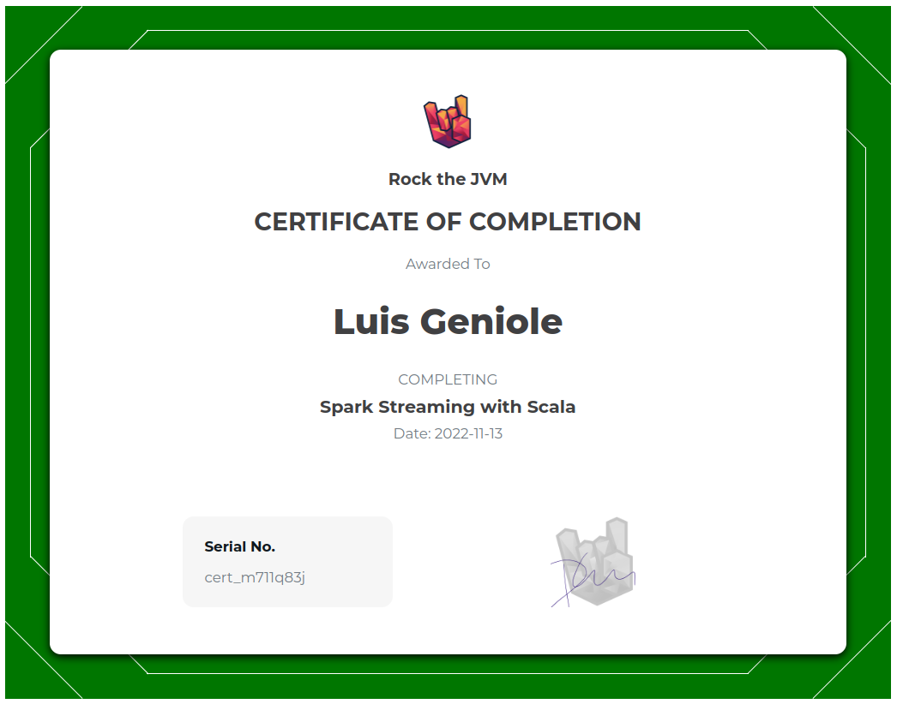

# Rock The JVM - Apache Spark Streaming

Master Spark's Streaming Library with Scala.

- https://rockthejvm.com/p/spark-streaming
- https://github.com/rockthejvm/spark-streaming
- https://github.com/rockthejvm/spark-streaming/releases/tag/start

## Certificate



## Sections

1. [Scala Recap](src/main/scala/section1)
2. [Structured Streaming](src/main/scala/section2)
3. [Low-level DStreams](src/main/scala/section3)
4. [Streaming Integrations](src/main/scala/section4)
5. [Twitter Sentiment Analysis](src/main/scala/section5)
6. [Advanced Streaming](src/main/scala/section6)
7. [Final Project](src/main/scala/section7)
7. [Twitter API v2 Sentiment Analysis](src/main/scala/section8)

## To Do

- [ ] Redo section 2 with Twitter's v2 API
    - [x] Read Sampled Stream endpoint with Apache's HTTP Client
    - [x] Read Sampled Stream endpoint in a Spark Stream
    - [ ] Read Filtered Stream endpoint with Apache's HTTP Client (English language tweets)
    - [ ] Read Filtered Stream endpoint in a Spark Stream
    - [ ] Compute average length of tweets
    - [ ] Compute most popular hashtags
    - [ ] Compute sentiment analysis with Stanford's NLP library

## Setup

### IntelliJ IDEA

Install IntelliJ IDEA with the Scala plugin.

- https://www.jetbrains.com/idea/

### Docker

Install Docker:

- https://docs.docker.com/desktop/install/ubuntu/
- https://docs.docker.com/engine/install/ubuntu/#set-up-the-repository

Start all required containers:

```bash
$ docker compose up
```

Access each container:

```bash
# Get a shell in any container
$ docker exec -it CONTAINER_NAME bash
# Get a PostgreSQL shell
$ ./psql.sh
# Get a Cassandra shell
$ ./cql.sh
```

To reset docker container state, purge them with:

```bash
$ ./docker-clean.sh
```

## Netcat

We will use netcat (`nc`) to test streaming data:

```bash
$ which nc
$ nc -lk 12345
```
